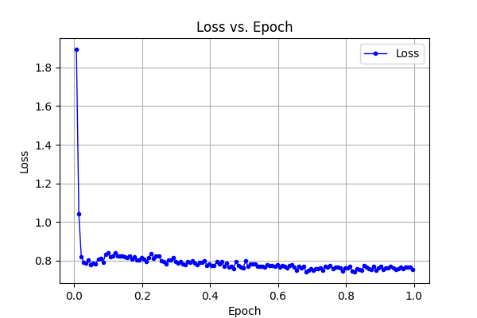
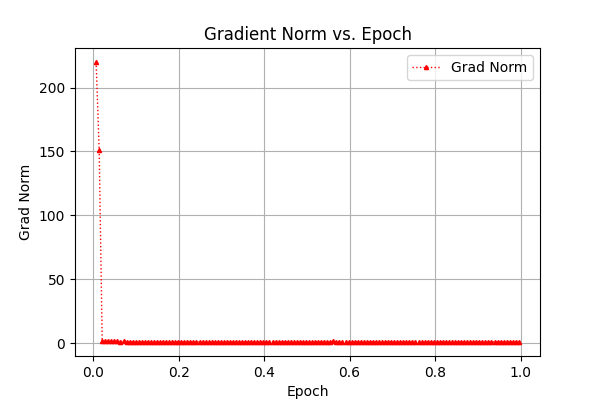
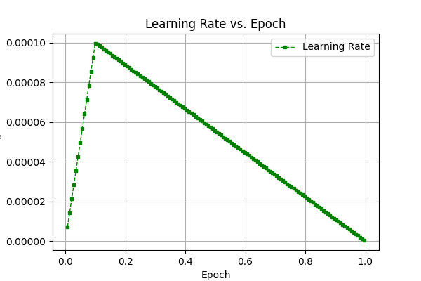
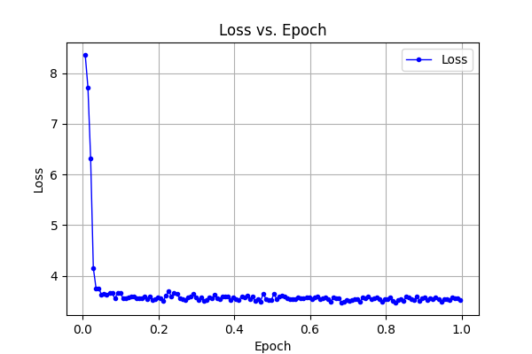
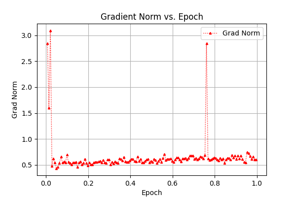
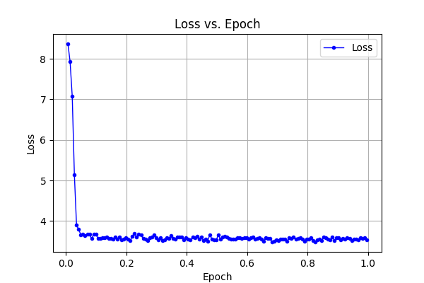
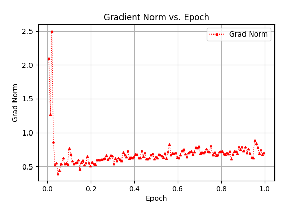

# Fine-tuning Phi-3 on Magpie-Reasoning Dataset

## Overview
This repository provides a script to fine-tune Microsoft's `phi-3-mini-4k-instruct` model on the `Magpie-Reasoning-V2-250K-CoT-Deepseek-R1-Llama-70B` dataset using the Hugging Face `transformers` and `trl` libraries. The fine-tuning process leverages LoRA for efficient adaptation and flash attention for memory optimization.

## Features
- Loads and preprocesses the `Magpie-Reasoning` dataset.
- Implements tokenization and special token handling.
- Configures and applies LoRA for efficient fine-tuning.
- Utilizes flash attention for faster inference.
- Defines a training pipeline using `SFTTrainer` from `trl`.
- Saves the fine-tuned model and tokenizer for further use.

## Installation
Ensure you have the required dependencies installed before running the script:
```bash
pip install torch transformers datasets accelerate peft trl bitsandbytes
```

## Dataset Preparation
The script loads the dataset from Hugging Face and splits it into training and test sets:
- Uses a 90%-10% train-test split.
- Scales the dataset size according to `scale` (default: 1).
- Formats the dataset for causal language modeling with system and user prompts.

## Tokenization
- Loads `phi-3-mini-4k-instruct` tokenizer.
- Adds custom tokens (`<think>`, `</think>`, `[PAD]`).
- Formats dataset examples using chat templates.

## Model Setup
- Loads `phi-3-mini-4k-instruct` from Hugging Face.
- Configures attention layers with `flash_attention_2`.
- Resizes token embeddings to accommodate additional tokens.
- Uses LoRA for efficient training with (`r=4`, `lora_alpha=8`, `lora_dropout=0.1`) and (`r=8`, `lora_alpha=16`, `lora_dropout=0.2`).

## Training Configuration
- Uses `TrainingArguments` with the following settings:
  - Epochs: 1
  - Batch size: 8
  - Gradient accumulation steps: 4
  - Learning rate: 1e-4
  - Mixed precision (BF16 or FP16 depending on GPU support)
  - AdamW optimizer with linear (or cosine) scheduler
- Uses `SFTTrainer` for supervised fine-tuning.

## Running the Script
To start training, simply run:
```bash
python train.py
```
The fine-tuned model and tokenizer will be saved to `./phi-3-deepseek-finetuned`.

## Output
After training, the script prints dataset sizes and saves:
- The fine-tuned model.
- The tokenizer.
- Training logs.

## Results
The results are visualized as `.png` files in the `/logs` directory (with different configurations saved in `config.txt`) and shown below:

<p align="center">



</p>
<p align="center"><em>LoRA not used, lr_scheduler_type="linear"</em></p>

<p align="center">



</p>
<p align="center"><em>LoRA(r=8, lora_alpha=16, lora_dropout=0.2), lr_scheduler_type="linear"</em></p>

<p align="center">



</p>
<p align="center"><em>LoRA(r=4, lora_alpha=8, lora_dropout=0.1), lr_scheduler_type="linear"</em></p>

## Notes
- `NCCL_P2P_DISABLE=1` and `NCCL_IB_DISABLE=1` are set to avoid potential issues with distributed training.
- The dataset and model caches are stored in `./Hcx`.

## Acknowledgments
- Model: [Microsoft Phi-3](https://huggingface.co/microsoft/phi-3-mini-4k-instruct)
- Dataset: [Magpie-Reasoning](https://huggingface.co/datasets/Magpie-Align/Magpie-Reasoning-V2-250K-CoT-Deepseek-R1-Llama-70B)
- Libraries: Hugging Face `transformers`, `trl`, `peft`, `bitsandbytes`

